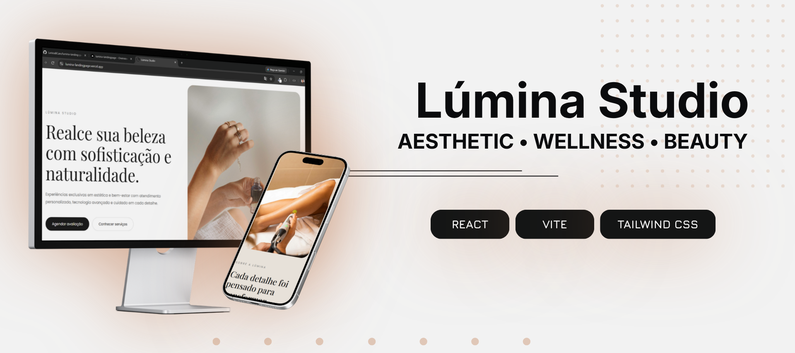
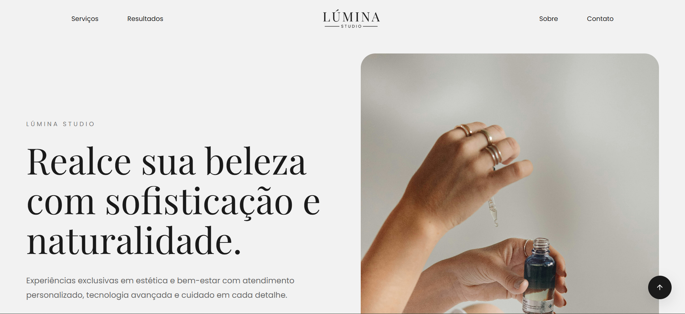

  

<h1 align="center">Lúmina Studio</h1>

  A premium landing page designed for a fictional aesthetic clinic.

  <a href="https://lumina-landingpage.vercel.app/">🌐 Live Demo</a>
  ·
  <a href="#-português">🇧🇷 Português</a>
  ·
  <a href="#-english">🇺🇸 English</a>

---

## 📊 Project Overview

|                |                  |
| :------------- | :--------------- |
| **Status**     | ✅ Completed     |
| **Type**       | Personal Project |
| **Framework**  | React            |
| **Build Tool** | Vite             |
| **Styling**    | Tailwind CSS     |
| **Language**   | JavaScript       |
| **Animation**  | Framer Motion    |
| **Icons**      | Lucide React     |
| **Deployment** | Vercel           |

---

# 🇧🇷 Português

## 📖 Sobre o projeto

**Lúmina Studio** é uma landing page premium desenvolvida para uma clínica estética fictícia.

O projeto foi criado com foco em **design minimalista, hierarquia visual e experiência do usuário**, buscando transmitir uma sensação de sofisticação e confiança através da interface.

A proposta foi criar uma experiência digital moderna para um negócio local, explorando a combinação entre **composição visual, tipografia e interações suaves**.

---

## ✨ Funcionalidades

- Interface responsiva
- Design minimalista e sofisticado
- Identidade visual autoral
- Navegação fluida
- Animações suaves
- Estrutura de landing page para negócios locais
- Layout adaptável para diferentes dispositivos

---

## 🛠️ Tecnologias

- React
- Vite
- JavaScript
- Tailwind CSS
- Framer Motion
- Lucide React

---

## 🎨 Foco do projeto

O principal foco deste projeto foi explorar a criação de uma **landing page premium**, trabalhando principalmente com:

- Composição visual
- Hierarquia de interface
- Tipografia
- Experiência do usuário
- Design minimalista
- Animações e microinterações

---

## 📷 Preview

  

---

## 🌐 Acesse o projeto

🔗 https://lumina-landingpage.vercel.app/

---

## 💡 Aprendizados

Durante o desenvolvimento deste projeto, pratiquei e aprimorei conhecimentos em:

- Desenvolvimento de interfaces com React
- Criação de landing pages
- Construção de layouts responsivos
- Uso do Tailwind CSS
- Animações com Framer Motion
- Criação de hierarquia visual
- Desenvolvimento de interfaces com foco em experiência do usuário

---

# 🇺🇸 English

## 📖 About the project

**Lúmina Studio** is a premium landing page designed for a fictional aesthetic clinic.

The project was created with a focus on **minimalist design, visual hierarchy and user experience**, aiming to communicate a sense of sophistication and trust through the interface.

The goal was to create a modern digital experience for a local business, exploring the combination of **visual composition, typography and smooth interactions**.

---

## ✨ Features

- Responsive interface
- Minimalist and sophisticated design
- Original visual identity
- Smooth navigation
- Subtle animations
- Landing page structure for local businesses
- Adaptive layout for different devices

---

## 🛠️ Technologies

- React
- Vite
- JavaScript
- Tailwind CSS
- Framer Motion
- Lucide React

---

## 🎨 Project focus

The main focus of this project was exploring the creation of a **premium landing page**, working mainly with:

- Visual composition
- Interface hierarchy
- Typography
- User experience
- Minimalist design
- Animations and microinteractions

---

## 🌐 Live Demo

🔗 https://lumina-landingpage.vercel.app/

---

## 💡 What I learned

Throughout the development of this project, I practiced and improved my knowledge of:

- React interface development
- Landing page development
- Responsive layout creation
- Using Tailwind CSS
- Animations with Framer Motion
- Building visual hierarchy
- User experience-focused interface development

---

  <i>Minimal design. Meaningful experiences.</i>

